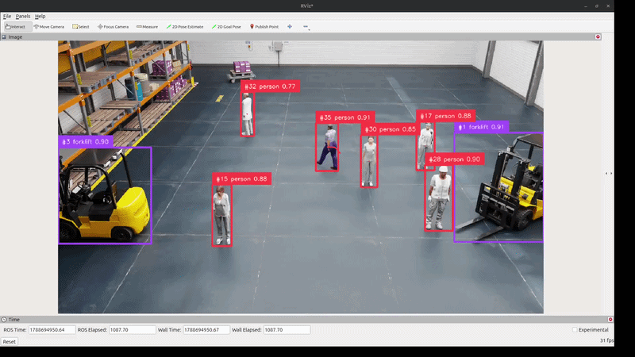

# RF-DETR Warehouse Perception

Real-time object detection and tracking with a custom-trained RF-DETR model inside NVIDIA Isaac Sim. A simulated warehouse with walking people streams its camera over ROS 2, a Python node runs the model on the GPU, and tracked detections show up live in RViz.

<!-- Add your demo GIF here -->


> Full step by step guide with every error I hit and how I fixed it: [Read the article on Medium](https://medium.com/@yourhandle/your-post-link-here)

## What this does

The pretrained COCO version of RF-DETR can find people in the warehouse but has no idea what a forklift is. So I used a dataset, fine-tuned RF-DETR on two classes (person, forklift), and connected it to the simulator through ROS 2. The result is a perception node that detects and tracks both classes in real time from the simulated camera.

```
Isaac Sim 5.1                    ROS 2 Jazzy                  RTX 5070 Ti
warehouse scene   ──/warehouse_camera/rgb──▶  rfdetr_node.py ──▶  /rfdetr/annotated  (image for RViz)
walking people                                RF-DETR + ByteTrack  /rfdetr/detections (Detection2DArray)
```

## Stack

| Piece | Version |
|---|---|
| Isaac Sim | 5.1.0 |
| ROS 2 | Jazzy (Ubuntu 24.04) |
| RF-DETR | Small, fine-tuned, 2 classes |
| Tracking | ByteTrack via supervision |
| GPU | RTX 5070 Ti 16GB |

## Dataset and model

- Training dataset (annotated forklift + person images): [Roboflow Universe](https://universe.roboflow.com/farukalamai/forklift-dsitv-ojkj6)
- Fine-tuned weights: download from [link](https://drive.google.com/file/d/1hld5K3stJ9UQYunHTIpD3_Qwb7OwyKA4/view?usp=sharing) and update `MODEL_WEIGHTS` in `ros2_node/rfdetr_node.py`, or train your own with the dataset above

## Quick start

This assumes Isaac Sim 5.1 and ROS 2 Jazzy are installed and the ROS 2 bridge extension is enabled. The full setup, including the warehouse scene, camera publishing, and animated people, is covered in the Medium article linked above.

```bash
git clone https://github.com/farukalamai/rfdetr-warehouse-perception.git
cd rfdetr-warehouse-perception

# Python env that can see both ROS 2 and RF-DETR
uv venv --python /usr/bin/python3 --system-site-packages .venv
source .venv/bin/activate
uv pip install -r requirements.txt

# PyTorch built for CUDA 12.8 (driver 570.x). Skip if your driver is 580+
uv pip install --reinstall torch torchvision --index-url https://download.pytorch.org/whl/cu128

# check that both worlds are visible
python -c "import rclpy, cv2, cv_bridge, torch, rfdetr, supervision; print(torch.cuda.is_available())"
```

Then, with the Isaac Sim scene playing and publishing `/warehouse_camera/rgb`:

```bash
python ros2_node/rfdetr_node.py
```

Open RViz, add an Image display on `/rfdetr/annotated`, and you should see numbered boxes with motion trails following the people and forklifts.


## Notes that may save you time

- The venv must be built on the system Python with `--system-site-packages`, otherwise `rclpy` and `cv_bridge` are invisible to it
- ROS 2 Jazzy ships packages compiled against NumPy 1.x, so `numpy<2` and `scipy<1.14` are pinned on purpose
- Isaac Sim only publishes camera topics while the simulation is playing

## Credits

Built on [RF-DETR](https://github.com/roboflow/rf-detr) by Roboflow, [supervision](https://github.com/roboflow/supervision), NVIDIA Isaac Sim warehouse assets, and ROS 2.

Useful NVIDIA resources if you want to learn this stack:

- [NVIDIA Physical AI learning hub](https://docs.nvidia.com/learning/physical-ai/index.html), free courses covering Isaac Sim, Isaac Lab, and sim to real workflows
- [Getting Started with Isaac Sim](https://docs.nvidia.com/learning/physical-ai/getting-started-with-isaac-sim/latest/index.html), includes the synthetic data generation course this project's next version builds on
- [Isaac Sim ROS 2 tutorials](https://docs.isaacsim.omniverse.nvidia.com/latest/ros2_tutorials/index.html), the camera publishing workflow used here
- [Isaac Sim Replicator tutorials](https://docs.isaacsim.omniverse.nvidia.com/latest/replicator_tutorials/index.html), for generating labeled training data in simulation